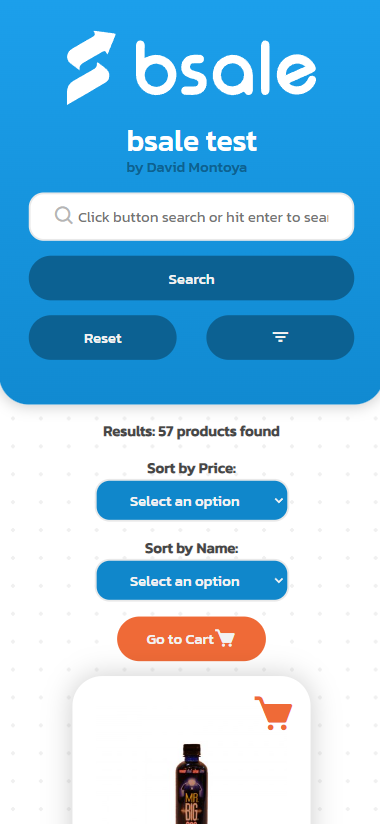

# BSale Test Client
This is the client front end for the Bsale Test App, challenge of BSale made by David Montoya

Here are the back and front end repositories
1) [API - Backend](https://github.com/DavidMontoya24/bsale-test-api)
2) [CLIENT - Frontend](https://github.com/DavidMontoya24/bsale-test-client)

This project consists of building a online store, where we can see the products, search and filter by category. The Frontend single-page application developed with
vanilla JavaScript that consumes data from the [API - Backend](https://github.com/DavidMontoya24/bsale-test-api)

## Used tools


## Funcionalities / Features

- When open list all the products availables
- Use the Search bar on the top to search products (case-insensitive add)
- Use the filters by category section to show products by category
- Use the sort by select to list products by name or price
- On mobile version display the categories list by click in the filter icon
- When click on the logo reset all the products

## Run Locally

Start a local server as Live Server with the project folder. You can change the BASE_URI variable in the config.js file.

```javascript
const URI = "https://bsale-test-api.fly.dev/";
```
or With the [API - Backend](https://github.com/DavidMontoya24/bsale-test-api) repo
```javascript
const URI = 'http://localhost:8080/';
```

## Builidng the app
#### Create the html index page
We create our html page for our single web page application, notice we have a ``<main id="root"></main>``  this will be the element that we going to target to create all our application
and we have to create our ``<script type="module" src="index.js"></script>`` as well
```html
  <!DOCTYPE html>
  <html lang="en">
  <head>
    <meta charset="UTF-8" />
    <meta name="viewport" content="width=device-width, initial-scale=1.0" />
    <link rel="stylesheet" href="styles/index.css" />
    <link href='https://unpkg.com/boxicons@2.1.4/css/boxicons.min.css' rel='stylesheet'>
    <title>Bsale-Test</title>
  </head>
  <body>
    <main id="root"></main>
    <script type="module" src="index.js"></script>
  </body>
  </html>
```

#### Set our DomBuilder function
This HOF takes a parent selector and returns an object with a load method that takes a module and a reload method that reloads the module
@param parent - The parent element that the module will be loaded into
```javascript
  function DomBuilder(parent) {
    const targetParent = document.querySelector(parent);

    if (!targetParent) throw new Error("Parent not found");

    return {
      module: null,
      load(module) {
        this.module = module;
        targetParent.innerHTML = module;
        module.addListeners();
      },
      reload() {
        this.load(this.module);
      },
    };
  }
```

#### Setting the services from the API
Thanks to a handler fetching custom function that we call `fetchAPI`
```javascript
  const fetchAPI = async (endpoint, { method, body } = {}) => {
    const config = {
      method: method || (body ? "POST" : "GET"),
  };

  const response = await fetch(URI + endpoint, config);

  let data;
  if (!response.ok) {
    try {
      data = await response.json();
    } catch (error) {
      throw new Error(response.statusText);
    }
    throw new Error(JSON.stringify(data));
  }

  try {
    data = await response.json();
  } catch (error) {
    data = response.statusText;
  }
  return data;
};
```

We will be able to set all our services requests, to get the products and categories
```javascript
  async function getCategories() {
    return await fetchAPI("categories");
  }

  async function getProducts() {
    return await fetchAPI("products");
  }

  async function getProductsByCtgry(ctgryId) {
    return await fetchAPI("categories/" + ctgryId + "/products");
  }

  async function getProductsByQuery(query) {
    return await fetchAPI("products/" + query);
  }
```

#### Setting the context of our services
This is a sort of a Redux strategy, but in a Vanilla Javascript mode that will handle our state variables and store them in our Providers objects
```javascript
  const productsProvider = {
    products: [],
    status: "pending",
    querySearch: "",
    fecthProducts,
    fetchProductsByCtgry,
    fetchProductsByQuery,
  };

  const ctgriesProvider = {
    categories: [],
    currentCategory: null,
    fetchCategories,
  };
```

#### Setting all the HTML for our Home Page as well of our components
```javascript

  const renderHomePage = () => {
  return `
  ${headerBar}
  <section class="container-xl">
    <div class="options-container">
      <p>Results: <strong>${products.length} products found</strong></p>

    ........

    <div class="pagination_wrapper flex">
      <button class="btn btn-primary js-btn-next"><i class='bx bxs-chevron-left'></i></button>
      <button class="btn btn-primary js-btn-back"><i class='bx bxs-chevron-right'></i></button>
    </div>
  </section>
  `;
  };

  export const homePage = {
  toString() {
    return renderHomePage();
  },
  addListeners() {
    // Here we add listeners
  },
};

```
#### Initialize our application
```javascript
  const runApp = async () => {
    try {
      await productsProvider.fecthProducts();
      await ctgriesProvider.fetchCategories();
      DomBuilder("#root").load(homePage);
    } catch (error) {
      console.log(error);
    }
  };

  runApp();
```


## Demo

### Responsive Design

- Desktop version
  

- Mobile version
  

- Display category list by clicking on the filter button
  
